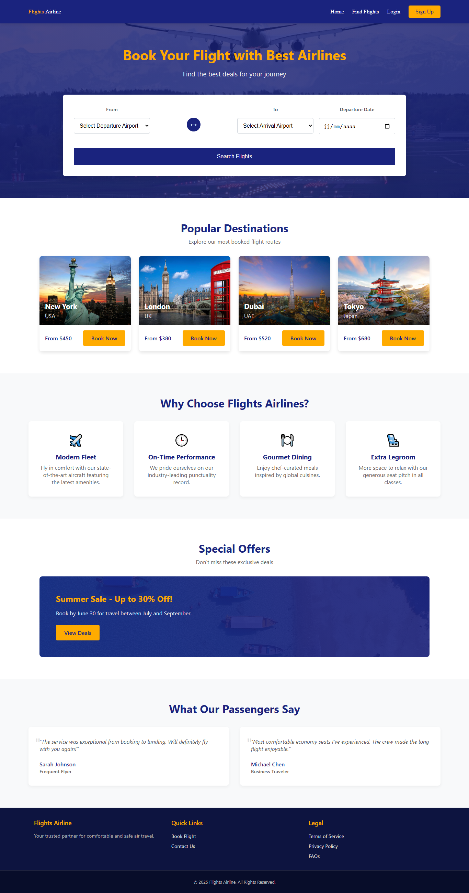
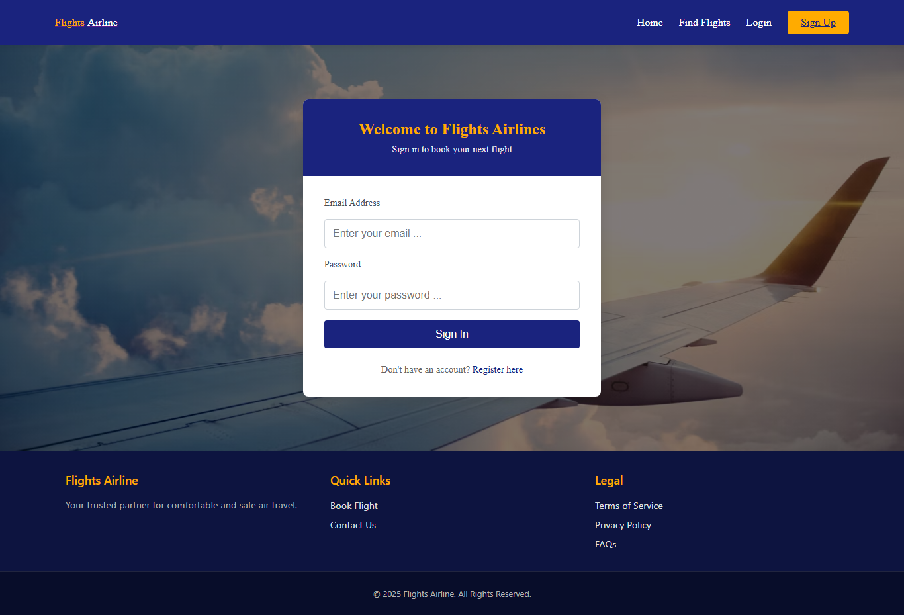
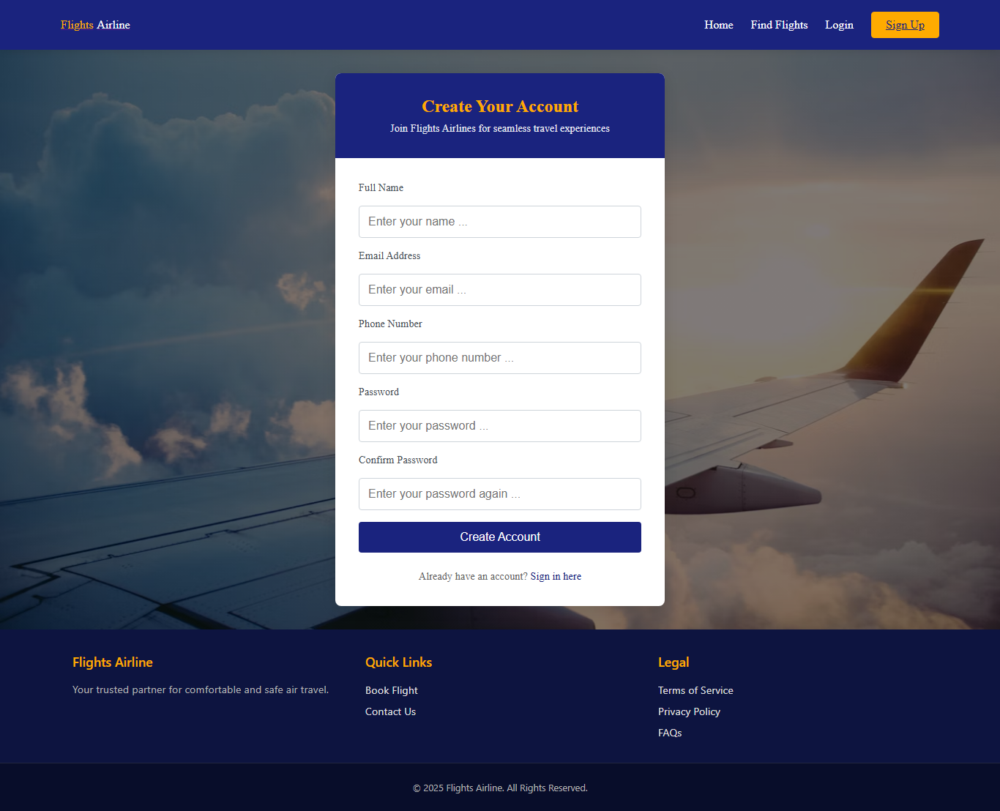
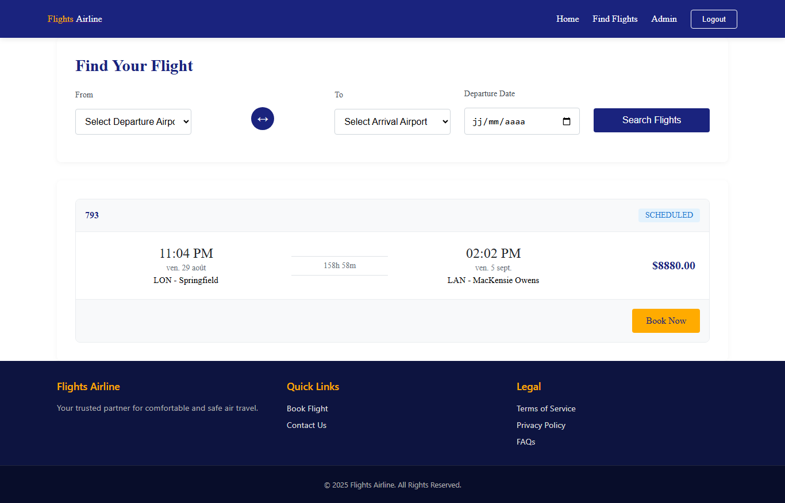
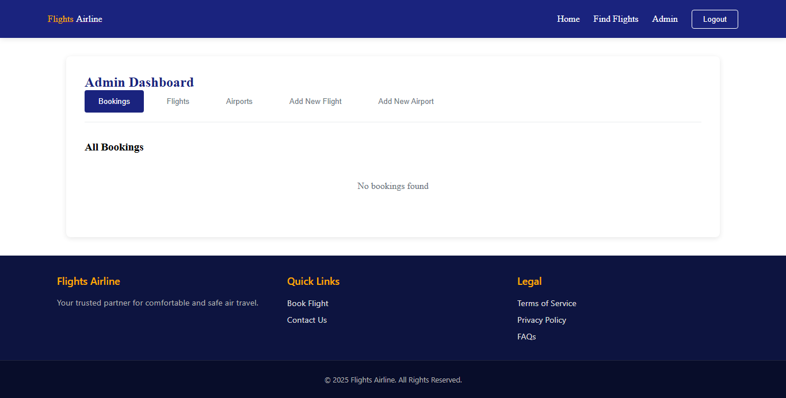
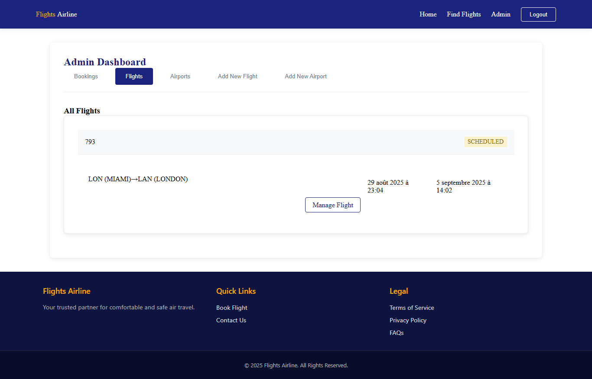
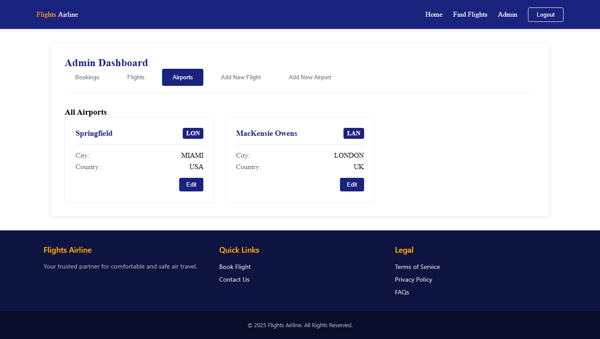
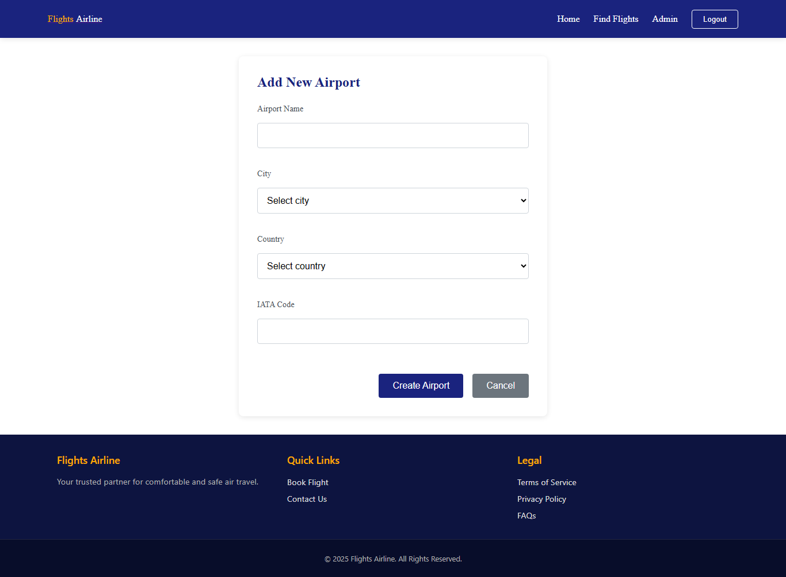
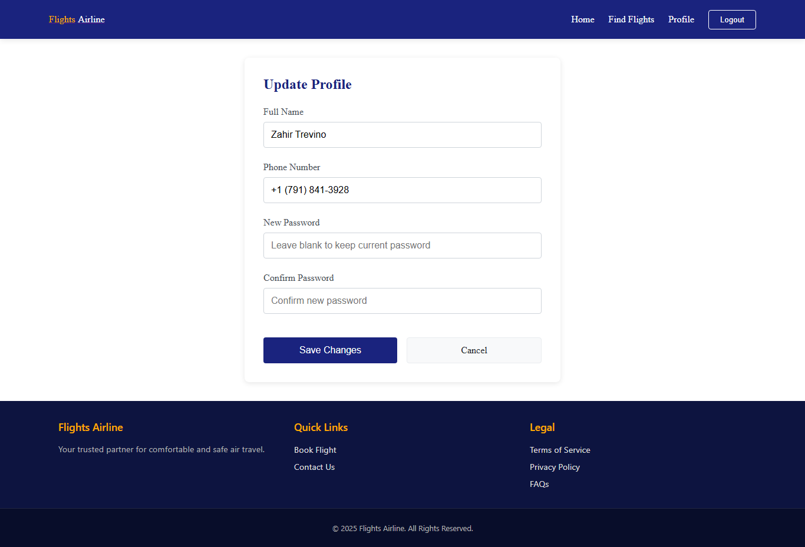
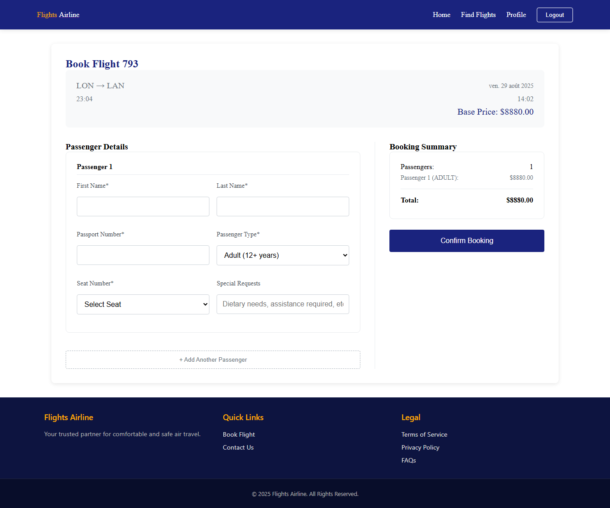

# Airline Booking Application

> A comprehensive application for booking airline tickets. This application allows users to search for flights, view available seats, make reservations, and manage their bookings.

## Table of Contents

- [Features](#features)
- [Getting Started](#getting-started)
  - [Prerequisites](#prerequisites)
  - [Installation](#installation)
  - [Configuration](#configuration)
- [Usage](#usage)
  - [Examples](#examples)
- [Contributing](#contributing)
- [License](#license)
- [Contact](#contact)

[⬆ back to top](#airline-booking-application)

## Features

> *   **Flight Search:** Allows users to search for flights based on origin, destination, and date.
> *   **Seat Selection:** Enables users to view available seats and select their preferred options.
>   **Booking Management:** Provides users with the ability to view, modify, or cancel their bookings.
>   **User Authentication:** Securely authenticates users for personalized booking experiences.
>   **Payment Integration:** Integrates with payment gateways for seamless transaction processing.

[⬆ back to top](#airline-booking-application)

## Getting Started

> Instructions on how to get your development environment set up.

[⬆ back to top](#airline-booking-application)

### Prerequisites

> List any dependencies that the project requires, such as specific versions of programming languages, frameworks, or tools. For example:

*   Node.js (v20 or higher)
*   npm (v10 or higher)
*   Git

[⬆ back to top](#airline-booking-application)

### Installation

> Step-by-step guide on how to install the project. For example:

1.  Clone the repository:

    
    API_KEY=[your-api-key]
    DATABASE_URL=[your-database-url]
    2.  Access the application in your browser at `http://localhost:3000`.
[⬆ back to top](#airline-booking-application)

## Contributing

> Guidelines for contributing to the project.

We welcome contributions from the community! To contribute:

1.  Fork the repository.
2.  Create a new branch for your feature or bug fix.
3.  Make your changes and commit them with descriptive commit messages.
4.  Push your changes to your fork.
5.  Submit a pull request.

> Please follow our [code of conduct](link-to-code-of-conduct).
[⬆ back to top](#airline-booking-application)

## Images

##### Home Page

[⬆ back to top](#airline-booking-application)

##### Login Page

[⬆ back to top](#airline-booking-application)

##### Register Page

[⬆ back to top](#airline-booking-application)

##### Find a Flight Page

[⬆ back to top](#airline-booking-application)

##### Admin Dashboard (Booking) Page

[⬆ back to top](#airline-booking-application)

##### Admin Dashboard (Flights) Page

[⬆ back to top](#airline-booking-application)

##### Admin Dashboard (Airports) Page

[⬆ back to top](#airline-booking-application)

##### Admin Dashboard (New Flight) Page

[⬆ back to top](#airline-booking-application)

##### Admin Dashboard (New Airport) Page

[⬆ back to top](#airline-booking-application)

##### Admin Dashboard (Update Profile) Page

[⬆ back to top](#airline-booking-application)

##### Admin Dashboard (Booking Details) Page

[⬆ back to top](#airline-booking-application)

## License

> Information about the project's license.

This project is free to use, you can contact me for more details.
[⬆ back to top](#airline-booking-application)

## Contact

> Contact information for the project maintainers.

*   [Abdelaaziz Ouakala]([https://dz.linkedin.com/in/abdelaaziz-ouakala])
*   [Project Repository]([https://github.com/O-Abdelaaziz/airline-booking-application])