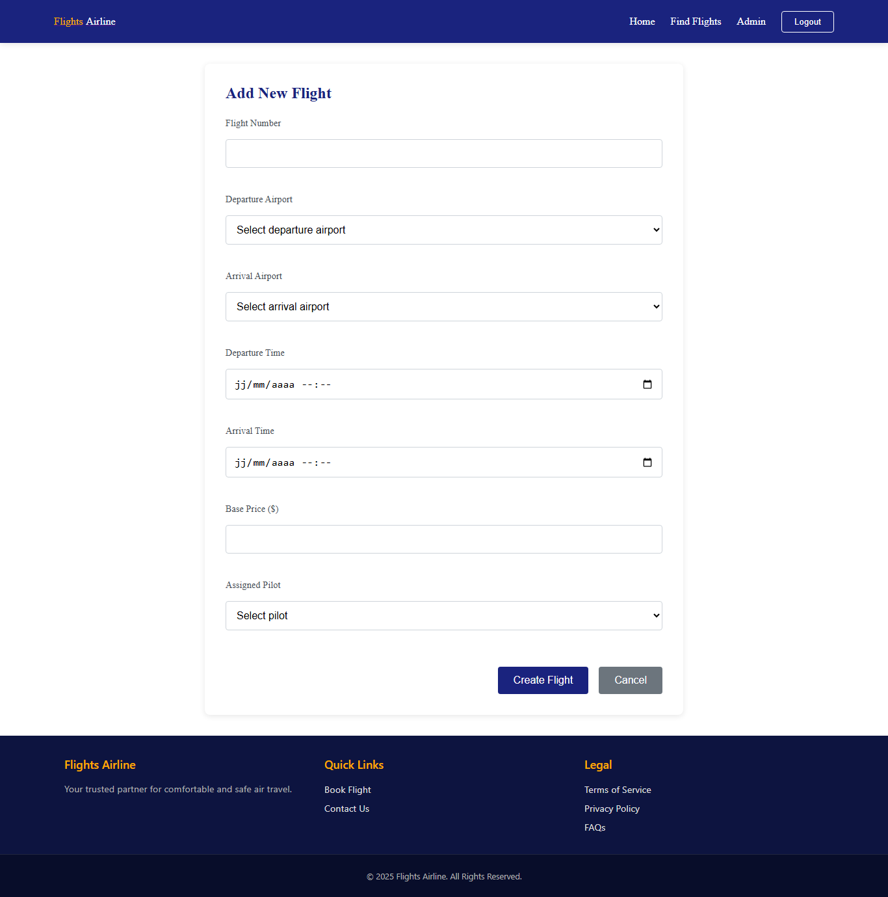

# Airline Booking Application

An advanced application meticulously crafted to streamline airline ticket bookings. This application empowers users to effortlessly search for flights, meticulously review available seat options, seamlessly make reservations, and efficiently manage their bookings, all within a unified and intuitive interface. Designed with the modern traveler in mind, this application focuses on providing a hassle-free and comprehensive booking experience.

## Table of Contents

- [Features](#features)
- [Getting Started](#getting-started)
  - [Prerequisites](#prerequisites)
  - [Installation](#installation)
  - [Configuration](#configuration)
- [Usage](#usage)
- [Contributing](#contributing)
- [License](#license)
- [Contact](#contact)
- [Troubleshooting](#troubleshooting)

[⬆ back to top](#airline-booking-application)

## Features

> *   **Flight Search:** Allows users to search for flights based on origin, destination, and date. This feature provides a comprehensive search interface with filters for time, airlines, and price ranges, ensuring users find the perfect flight for their needs.
> *   **Seat Selection:** Enables users to view available seats and select their preferred options. The interactive seat map displays real-time availability and seat characteristics (e.g., window, aisle, legroom) for informed decision-making.
> *   **Booking Management:** Provides users with the ability to view, modify, or cancel their bookings. A user-friendly dashboard allows easy access to booking details, modification options, and cancellation policies.
>   **User Authentication:** Securely authenticates users for personalized booking experiences. Utilizing industry-standard encryption and secure protocols, the application ensures user data privacy and protection against unauthorized access.
>   **Payment Integration:** Integrates with payment gateways for seamless transaction processing. Supports multiple payment methods (e.g., credit cards, PayPal) and ensures secure transaction processing through PCI-compliant gateways.
>   **Admin Dashboard:** A comprehensive admin panel to manage flights, airports, and bookings. Includes features for adding new flights, updating airport information, and monitoring booking statuses.

[⬆ back to top](#airline-booking-application)

## Getting Started

> Instructions on how to get your development environment set up.

[⬆ back to top](#airline-booking-application)

### Prerequisites

> List any dependencies that the project requires, such as specific versions of programming languages, frameworks, or tools. For example:

*   Node.js v16.0 or higher (Recommended v18.x)
*   npm v7.0 or higher (Recommended v9.x)
*   Git

[⬆ back to top](#airline-booking-application)

### Installation

> Step-by-step guide on how to install the project. For example:

1.  Clone the repository:

    bash
    npm install
    2.  Add the following environment variables to the `.env` file:

    bash
    npm start
    4.  Access the application in your browser at `http://localhost:3000`.

[⬆ back to top](#airline-booking-application)

## Usage

> Examples of how to use the application's main features.

1.  **Home Page:** Upon opening the application, users are greeted with a visually appealing home page, showcasing key features and promotions.

    

2.  **Login Page:** Users can log in to their accounts to access personalized booking options and manage their reservations.

    

3.  **Flight Search:** The flight search page allows users to specify their origin, destination, and travel dates to find available flights.

    

4.  **Admin Dashboard (Flights):** Administrators can manage flight information, including adding new flights and updating existing ones.

     Page")

[⬆ back to top](#airline-booking-application)

## Contributing

> Guidelines for contributing to the project.

We welcome contributions from the community! To contribute:

1.  Fork the repository.
2.  Create a new branch for your feature or bug fix.
3.  Make your changes and commit them with descriptive commit messages.
4.  Push your changes to your fork.
5.  Submit a pull request.

> Please follow our [code of conduct](https://example.com/code-of-conduct).

[⬆ back to top](#airline-booking-application)

## Images

##### Home Page

[⬆ back to top](#airline-booking-application)

##### Login Page

[⬆ back to top](#airline-booking-application)

##### Register Page

[⬆ back to top](#airline-booking-application)

##### Find a Flight Page

[⬆ back to top](#airline-booking-application)

##### Admin Dashboard (Booking) Page

[⬆ back to top](#airline-booking-application)

##### Admin Dashboard (Flights) Page

[⬆ back to top](#airline-booking-application)

##### Admin Dashboard (Airports) Page

[⬆ back to top](#airline-booking-application)

##### Admin Dashboard (New Flight) Page

[⬆ back to top](#airline-booking-application)

##### Admin Dashboard (New Airport) Page

[⬆ back to top](#airline-booking-application)

##### Admin Dashboard (Update Profile) Page

[⬆ back to top](#airline-booking-application)

##### Admin Dashboard (Booking Details) Page

[⬆ back to top](#airline-booking-application)
## License

> Information about the project's license.

This project is open source under the **MIT License**. See the [LICENSE](LICENSE) file for details.

[⬆ back to top](#airline-booking-application)

## Contact

> Contact information for the project maintainers.

*   [Abdelaaziz Ouakala](https://dz.linkedin.com/in/abdelaaziz-ouakala)
*   [Project Repository](https://github.com/O-Abdelaaziz/airline-booking-application)

[⬆ back to top](#airline-booking-application)

## Troubleshooting

> Common issues and solutions.

1.  **Installation Errors:**

    *   **Problem:** `npm install` fails with errors related to missing dependencies.
    *   **Solution:** Ensure you have the correct versions of Node.js and npm installed. Try running `npm install --legacy-peer-deps` to resolve peer dependency issues.

2.  **Configuration Issues:**

    *   **Problem:** The application fails to start due to incorrect environment variable settings.
    *   **Solution:** Double-check the `.env` file for typos in the variable names or values. Ensure that the `API_KEY` and `DATABASE_URL` are correctly obtained from their respective providers.

3.  **Database Connection Errors:**

    *   **Problem:** The application cannot connect to the database.
    *   **Solution:** Verify that the database server is running and that the `DATABASE_URL` in the `.env` file is correct. Check the database credentials (username, password, host, port) for accuracy.